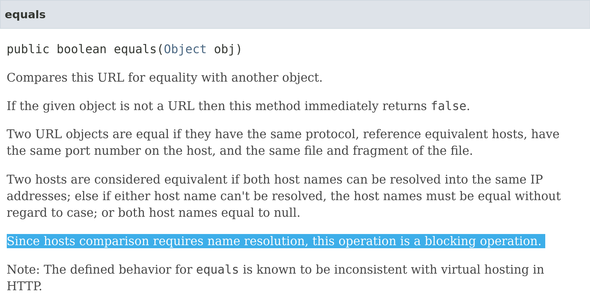

---
css:
  - ./assets/css/variables.css
  - ./assets/css/styles.css
title: Effect Systems in Practice
subtitle:
introductory_notes: |
  Hello everyone,
  this talk about practical programming with effects in Haskell
light: true
#ratio43: true
overlay: MuniHac 2024
author:
  - name: Hécate
    desc:
      - Software Engineer / PM at Scrive </br> <span class="big-2">&</span>
      - Helping hand at the Haskell Foundation </br> <span class="big-2">&</span>
      - Trade Unionism at Solidaires Informatique

---

# Follow the presentation

:::jumbogroup

:::

---

# Structure of this talk

* What this talk is not about
* The need for side-effect tracking: IO
* Semantic Effect Tracking
* Effect Systems, their implementation, their tragedies

---

# What this talk is not about

This is not a deep dive into the theoretical implications of algebraic effects

- *Delimited continuations*?

- ➡️ Check out the talks of Alexis King and Ningning Xie

:::notes
If I think you'll receive a better answer from one of them, I will redirect you to their work
:::

---

# 🤡

:::jumbogroup

:::

> Java™ Platform Standard Ed. 8, docs.oracle.com

---

# The need for side-effect tracking

## Determinism, Referential transparency

* > Determinism: The output of an expression stays the same if the input is the same
* > Referential transparency: You can replace a call to a function with its result in a safe and predictible manner

:::notes
Interactions with the outside world in non-reproducible ways is the burden of many programmers.
I want to clarify some notions here that make life much, much easier.
:::

---

# The need for side-effect tracking

## No side effects

* No alteration of the outside world in ways that matter to us
  * Missile strike? No!
  * Register alloation? Fairly essential.

::: notes
Meanwhile in an Eternal War alternate reality based on launching missiles: we do not allocate registers willy-nilly!
:::

---

# The need for side-effect tracking

## Side effects are arbitrary

> A function without any effect is called total and corresponds to mathematically total functions – a good place to be.
> Then we have effects for partial functions that can raise exceptions (exn), and potentially non-terminating functions as div (divergent).
> **The combination of exn and div is called pure as that corresponds to Haskell's notion of purity.**

– "The Koka Programming Language"

:::notes
Now, does that mean that IO is complete bullshit? No! We needed an analytical framework to understand and anticipate the results of programs, and IO was the option that was retained **at the time**
:::

---

# The need for side-effect tracking

## Enforcing sequentiality of computations

### When you're a pure lambda calculus girl living in a pure lambda calculus world, life in plastic _is_ indeed fantastic!

:::notes
You can do a lot with the generated code, like re-organise it, inline it, anticipate what it will do and replace function calls.
Inlining becomes easier as well, when you know for a fact that.
:::

---

# The need for side-effect tracking

## Enforcing sequentiality of computations

### But how about computations that depend on each-other?

::: notes
However you can't do much when it comes to interacting with the outside world, and at the level of code generation, there are things that are absolutely forbidden, like re-organising the order of computations that depend on each-other and that produce side-effects.
:::

---

# Interlude: Anatomy of a type signature

```haskell
fun :: a
```

```haskell
       ❗
      ┌──┐
fun :: IO a
```

``` haskell
            ❗
      ┌──────────────┐
fun :: (Constraint a) => IO a
```

---

# Semantic side-effect tracking

## These functions could be doing anything

```haskell
trace :: Text -> IO a -> IO a

fetchFromCache :: Int -> IO (Maybe Result)

log :: Text -> IO ()

fetchFromDB :: Int -> IO (Maybe Result)

throwError :: ServerError -> IO ()
```

::: notes
The signification of `IO` is, fundamentally: I give up.
We saw earlier that Haskell admits runtime exceptions as part of its model for purity (think about `undefined` or `error`).
:::

---

# Semantic side-effect tracking

<div class="big-3 horizontally-centered">
Semantic Opacity
</div>

```haskell
myComputation :: Int -> IO Result
myComputation number = trace "myComputation" $ do
  mCacheResult <- fetchFromCache number
  case mCacheResult of
    Just cacheResult -> do
      log "Found result from cache"
      pure cacheResult
    Nothing -> do
      log "No result in cache"
      mDatabaseResult <- fetchFromDB number
      case mDatabaseResult of
        Nothing -> do
          log "No result in database"
          throwError notFound
        Just dbResult -> do
          log "Found result from database"
          pure dbResult
```

::: notes
Putting every type of outside interaction into the 'IO' box is Semantic Opacity:
This leads us into a mental framework of pure versus impure, good versus evil, safe versus unsafe,
which is not only wrong but also steers us in the wrong direction for thinking about systems.

From an architectural point of view we need to be able to know what are the interactions
of our systems.
:::

---

# Semantic side-effect tracking

<div class="big-3 horizontally-centered">
Semantic clarity
</div>


```haskell
trace :: (Trace :> es) => Text -> Eff es a -> Eff es a

fetchFromCache :: (Cache :> es) => Int -> Eff es (Maybe Result)

log :: (Log :> es) => Text -> Eff es ()

fetchFromDB :: (DB :> es) => Int -> Eff es (Maybe Result)

throwError :: (Error ServerError :> es) => ServerError -> Eff es ()
```

```haskell
myComputation :: Int -> Eff [Trace, Log, Cache, DB, Error ServerError] Result
```

<div class="horizontally-centered big-3">
 🎉 🎉 🎉
</div>

::: notes
We were blindly using IO to say "all bets are off", and now we are listing,
with precision, well-understood effects that denote interactions with various outside systems.

Lo and behold: suddenly `myComputation` makes a lot more sense!

Notice that we are using the syntax for constraints here. With the help of the compiler,
redundant constraints are signalled, and can tell you if you have mistakenly removed an
interaction with an outside system, because this interaction is labeled at the types level.
:::

---

# Effect Systems 

<div class="horizontally-centered big-3">
Their implementation 
</div>

<div class="horizontally-centered big-1">
Their tragedies
</div>

---

# Effect Systems

## Historically: Monad Transformers

* Newtypes around values with a custom `Monad` instance

---

### Monad Transformers Stacks

```haskell
newtype ReaderT r m a
ask :: Monad m => ReaderT r m r
```

* `r`: The static environment that we pass along
* `m`: The monad on which the transformer is stacked
* `a`: The return value of the computation

#### Stack 'Em Up! 😎


```haskell
ReaderT Int IO String
```

* Top monad: `Reader`
  * Its environment: `Int`
* Base monad:  `IO`
* Return value: `String`

---

### Monad Transformer Stacks

::: big-2
Want to access an underlying monad? 
:::

---

### Monad Transformer Stacks

::: big-2
Want to access an underlying monad? 
:::


---

### Monad Transformer Stacks

::: big-2
Want to access an underlying monad? Lift! 🛗
:::

```haskell
import Control.Monad.Trans.Reader
import Control.Monad.Trans.Class

action :: ReaderT Int IO String
action = do
  lift $ putStrLn "I access IO!" 
  number <- ask
  pure $ show number
```

---

### Monad Transformer Babel Towers

What the hell am I supposed to do with this…

```haskell
action2 :: ReaderT Int (StateT Env (WriterT [Int] IO)) String
action2 = do
  liftIO $ putStrLn "I have to use a shortcut for IO"
  lift $ lift $ tell [42] -- 🪖⛏🪨
  pure $ "… and all I got was this lousy t-shirt."
```

---

### Monad Transformer Babel Towers

What the hell am I supposed to do with this…

```haskell
action2 :: ReaderT Int (StateT Env (WriterT [Int] IO)) String
action2 = do
  liftIO $ putStrLn "I have to use a shortcut for IO"
  lift $ lift $ tell [42] -- 🪖⛏🪨
  pure $ "… and all I got was this lousy t-shirt."
```

#### This is something I found at work
(_Names have been changed to protect the innocent_)

```haskell
ReaderT AuthEnv (
  RedisReaderT Persistent (
    CryptoRNGT (
      DBT (
        LogT (
          TraceT IO)))))
```
---

### In Conclusion

* Historical solution for making type signatures more declarative
* Fixed order of effects
* The same effects are always available all the time

---

### Monad Transformer Library (`mtl`)

```haskell
class Monad m => MonadReader r m | m -> r where
  ask :: m r
```

* `r`: The static environment that we pass along
* `m`: The monad that we specify to have `Reader` capabilities
* No `a` mentioned, it's the one from your type signature

#### Effects live as Constraints.
As a consequence:

 * No rigid order of effects **all the time**
 * Omission of unneeded effects
 * GHC tells us about unused effects

---

### Monad Transformer Library (`mtl`)

#### Constraints in Action

```haskell
( Reader AuthEnv m
, RedisReader PersisTent m
, CryptoRNG m
, DB m
, Log m
, Trace m
) => m Handler
```

Six constraints could mean six appearances of `(>>=)` between each monadic action.

Specialisation is thus mandatory for GHC to produce decent code!

---

### Liftin'? I barely know 'im!

No need for lifting in the user code.

```Haskell
instance MonadReader r m => MonadReader r (StateT s m) where
  ask = lift ask
```

---

### Liftin'? I barely know 'im!

However it has to happen somewhere.

```haskell
instance MonadReader r m => MonadReader r (ExceptT e m)
  ask = lift ask

instance MonadReader r m => MonadReader r (IdentityT m)
  ask = lift ask

instance MonadReader r m => MonadReader r (MaybeT m)
  ask = lift ask

instance MonadReader r m => MonadReader r (Lazy.StateT s m)
  ask = lift ask

instance MonadReader r m => MonadReader r (Strict.StateT s m)
  ask = lift ask

instance (Monoid w, MonadReader r m) => MonadReader r (CPS.WriterT w m)
  ask = lift ask

instance (Monoid w, MonadReader r m) => MonadReader r (Lazy.WriterT w m)
  ask = lift ask

instance (Monoid w, MonadReader r m) => MonadReader r (Strict.WriterT w m)
  ask = lift ask
```

---

### In Conclusion

* Based on `transformers`
* Usage of constraints give more flexibility
* Boilerplate has to be managed with compiler extensions

---

## Free Monads

Free Monads give any Functor a monadic structure, much like `Semigroup` gives any `Type` a concatenable structure

```haskell
data Free f a
  = Pure a
  | Free (f (Free f a))
```

The main appeal of Free monads is that since you reify your computation **as** a data structure, you can inspect it.

---

## Free Monads

### Time to pay up

#### Inspection is **not** Static Analysis

* Monadic actions mean that computations depend on each-other
* You have to generate values for each action because the next one depends on it

#### Performance trade-offs

Two kinds of Free Monads

* The naïve ones that run in quadratic time, and have linear inspection
* The co-density ones that run in linear time, but have quadratic inspection

---

## Free Monads

### Upsold on freedom

Free**er** Monads are supposed to solve problems of Free Monads, but remain exotic.

---

## Free Monads

### Upsold on freedom

Free**er** Monads are supposed to solve problems of Free Monads, but remain exotic.

### You actually run two programs

Free Monads build a program on top of your program, to generate the code that will be executed.

---

## Free Monads

Main libraries:

* `freer-simple`
  * Does not allow higher-order effects
* `polysemy`
  * Need a GHC plugin to attain reasonable performance

### In Conclusion

* Two operations: "run" and "inspect", and you need to tailor your implementation for one of these
* Program is slow to run in any case

---

### In Conclusion


---

# Now Introducing: Effectful

:::jumbogroup

:::

---

# Now Introducing: Effectful

> Created by Andrzej Rybczak in 2021

## Integrations
  * Drop-in solution in 🫵 your codebase
  * Integrations with `unliftio`, `exceptions`, `resourcet`

## Correctness
  * To hell with counter-intuitive interactions!

## Performance
  * `SmallMutableArray` + `RealWorld`
  * `PrimArray Int`
  * Strict `IORef`

:::notes
Effectful stems from the double need of replacing stacks of a dozen transformers in industrial
code bases. For this, it needs very good integration with libraries like `unliftio`, `exceptions`, `resourcet`, because it is made to be dropped into in an ecosystem of libraries.

However, it does not inherit types from the `transformers` library.
For the sake of correctness, Effectful re-implemented the State, Writer, and Except transformers. While ReaderT does not have any surprising behaviour,
the ways StateT and ExceptT interact together can be pretty counter-intuitive! Especially, dropping state updates is not cool, and the fact that
ExceptT does not raise a runtime exception means that resources are not freed. It's very easy to inadvertently trigger a space leak.

As such, the performance need not to be just decent but very good. It makes use of IORefs, and low-level Haskell constructs like mutable arrays.
:::

---

# Now Introducing: Effectful

* Like `transformers`: Concrete monad: `Eff`
  * No need for aggressive specialisation
* Like `mtl`: Effects can be Constraints:
  * `(MyEffect :> es) => Eff es`
* Unlike Free Monads, handlers are called in-place, thanks to _evidence-passing_.
  * No "program tree" is built at run-time
* Restrictions on non-determinism
  * The need for `MonadUnliftIO` (`fork`, `bracket`) outweighs the benefits of delimited continuations

---

# Now Introducing: Effectful

## Ergonomics

From:

```haskell
webHandler
  :: ( MonadBaseControl IO m , MonadCatch , MonadDB m , MonadFileStorage m
     , MonadLog m , MonadMask m , MonadRandom m , MonadThrow
     , MonadTime m , MonadTrace m)
```

to

```haskell
webHandler
  :: ( FileStorage :> es
     , RNG :> es
     , Log :> es
     , Time :> es
     , Trace :> es
     , DB :> es)
```

::: notes
Offering good ergonomics to replace your bare ReaderT or your MTL constraints.

The Eff monad has instances for MonadThrow, MonadCatch, MonadMask, and `MonadBaseControl IO`, so you don't have to specify them manually.
:::

---

## Errors that do not punish the user

The library understand how it is being mis-used

### Transformers

```haskell
Main.hs:34:12: error:
    • Couldn't match type: StateT Env (WriterT [Int] IO)
                     with: WriterT a0 IO
      Expected: ReaderT Int (StateT Env (WriterT [Int] IO)) String
                -> Int -> WriterT a0 IO String
        Actual: ReaderT Int (StateT Env (WriterT [Int] IO)) String
                -> Int -> StateT Env (WriterT [Int] IO) String
```

### Effectful

```haskell
Main.hs:14:13: error:
    • There is no handler for 'State Int' in the context
```

---

## Errors that do not punish the user

you get actionable advice

```haskell
If you want to use the unlifting function to run Eff computations in multiple threads,
  have a look at UnliftStrategy (ConcUnlift).
CallStack (from HasCallStack):
  error, called at src/Effectful/Internal/Unlift.hs:105:12
  seqUnlift, called at src/Effectful/Internal/Monad.hs:230:20
  seqUnliftIO, called at src/Effectful/Internal/Monad.hs:204:40
  withEffToIO, called at src/Effectful/Internal/Monad.hs:373:40
Test suite: FAIL
```

::: notes
It happens that I use the `unlift` function to implement a JSON file backend for the logging library I use,
and so I am directed to entities that I can look up on Hoogle!
:::

---

# My thanks to

* Alexis King
* Andrzej Rybczak
* Ningning Xie
* Xiaoyan Ren

---

# Sources

* _"The Koka Programming Language", §2.2 "Effect Typing"_, <https://koka-lang.github.io/koka/doc/book.html#why-effects>
* _"Lifts for free: making mtl typeclasses derivable"_, 2017, <https://lexi-lambda.github.io/blog/2017/04/28/lifts-for-free-making-mtl-typeclasses-derivable>
* _"Free monads considered harmful"_, 2017, <https://markkarpov.com/post/free-monad-considered-harmful.html>
* _"Free Monads for Less (Part 1 of 3): Codensity"_, 2011, <https://ekmett.github.io/reader/2011/free-monads-for-less/index.html>
